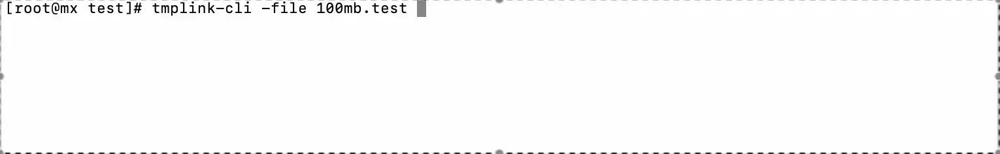
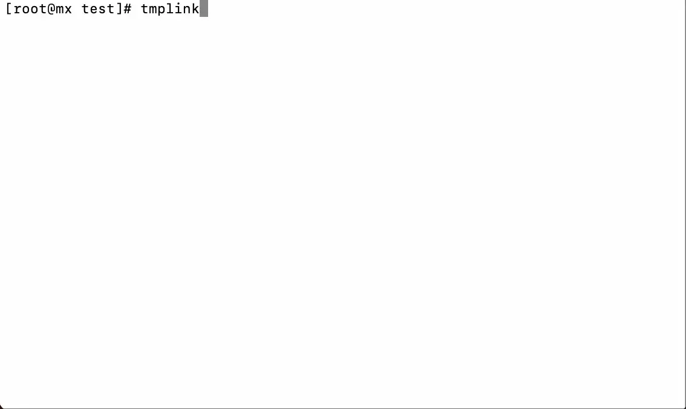

# 钛盘上传工具 🚀

简单易用的 [钛盘](https://tmp.link/) 文件上传工具，支持大文件、断点续传、批量上传。

## 📦 概览

### 在命令行下使用纯命令的方式上传文件



### 在命令行下使用图形界面上传文件



## ✨ 特色功能

- 🎯 **一键上传** - 支持最大 50GB
- ⚡ **超快速度** - 分块上传 + 多线程，充分利用网络带宽
- 🔄 **断点续传** - 网络中断自动恢复，大文件上传无忧
- 📱 **双界面** - 图形界面日常使用，命令行脚本自动化
- 💎 **会员功能** - 赞助用户享受更多高级设置

## 🚀 快速开始

### 安装方式

#### 📦 一键安装（推荐）

**方式一：在线安装脚本**

Linux 系统：
```bash
curl -fsSL https://raw.githubusercontent.com/tmplink/tmplink_uploader/main/install-linux.sh | bash
```

macOS 系统：
```bash
curl -fsSL https://raw.githubusercontent.com/tmplink/tmplink_uploader/main/install-macos.sh | bash
```

Windows 系统（PowerShell 管理员模式）：
```powershell
iex ((New-Object System.Net.WebClient).DownloadString('https://raw.githubusercontent.com/tmplink/tmplink_uploader/main/install-windows.ps1'))
```

**方式二：下载后安装**

下载项目：
```bash
git clone https://github.com/tmplink/tmplink_uploader.git
cd tmplink_uploader
```

Linux 系统：
```bash
./install-linux.sh
```

macOS 系统：
```bash
./install-macos.sh
```

Windows 系统：
```powershell
.\install-windows.ps1
```

安装完成后，命令 `tmplink` 和 `tmplink-cli` 将可在任何位置使用。

#### 💾 手动下载

如果不想使用安装脚本，可从 [build](build/) 目录下载预编译版本：

- **Windows**: `windows-64bit` 或 `windows-32bit`
- **macOS**: `macos-arm64` (M1/M2) 或 `macos-intel`
- **Linux**: `linux-64bit`、`linux-32bit` 或 `linux-arm64`

### 获取访问令牌

1. 打开 [钛盘网站](https://tmp.link/) 并登录
2. 点击上传文件，然后点击"重新设定"
3. 在"命令行上传"界面复制你的 Token

### 开始使用

#### 🖥️ 图形界面（推荐新手）

```bash
# 如果使用了安装脚本，直接运行：
tmplink

# 如果手动下载，需要指定路径：
# Windows
tmplink.exe

# macOS/Linux
./tmplink
```

首次启动会要求输入 Token，之后就能通过界面选择文件上传了。

#### ⌨️ 命令行（适合进阶用户）

```bash
# 如果使用了安装脚本：
# 保存 Token（只需一次）
tmplink-cli -set-token 你的TOKEN

# 上传文件
tmplink-cli -file 文件路径

# 如果手动下载，需要指定路径：
./tmplink-cli -set-token 你的TOKEN
./tmplink-cli -file 文件路径
```

## 📖 使用示例

### 图形界面操作

启动后按方向键导航：
- **选择文件** → 浏览并选择要上传的文件
- **开始上传** → 实时查看上传进度和速度
- **查看结果** → 获取下载链接并复制

### 命令行常用操作

```bash
# 上传单个文件
tmplink-cli -file ~/Documents/report.pdf

# 大文件上传（使用更大分块）
tmplink-cli -file ~/Videos/movie.mp4 -chunk-size 10

# 永久保存重要文件
tmplink-cli -file ~/backup.zip -model 99

# 临时使用其他 Token
tmplink-cli -file test.txt -token 临时TOKEN
```

## ⚙️ 参数说明

### 基础参数
- `-file` 文件路径（必需）
- `-token` API Token（可保存到配置）
- `-chunk-size` 分块大小，1-99MB（默认3MB）
- `-model` 文件保存时长：0=24小时，1=3天，2=7天，99=永久

### 配置管理
- `-set-token` 保存 Token 到配置文件
- `-set-model` 设置默认保存时长  
- `-set-mr-id` 设置默认上传目录

## 🔧 常见问题

### macOS "无法验证开发者"
```bash
xattr -d com.apple.quarantine tmplink tmplink-cli
```

### Linux/macOS 权限问题
```bash
chmod +x tmplink tmplink-cli
```

### Windows Defender 警告
点击"更多信息" → "仍要运行"，或将程序添加到信任列表。

### 上传失败排查
1. 检查网络连接
2. 验证 Token 是否有效
3. 使用 `-debug` 参数查看详细错误

```bash
tmplink-cli -debug -file test.txt
```

## 📚 了解更多

- [详细使用指南](docs/usage.md) - 完整功能介绍和高级用法
- [技术文档](docs/technical.md) - 开发者和技术爱好者参考
- [API 文档](docs/api.md) - 钛盘 API 接口说明

## 🆘 获取帮助

遇到问题？试试这些：

```bash
# 查看所有命令参数
tmplink-cli -h

# 启用详细日志
tmplink-cli -debug -file yourfile.txt
```

还有问题？[提交 Issue](https://github.com/tmplink/tmplink_uploader/issues) 或查看[详细文档](docs/)。

## 📄 开源协议

本项目基于 [Apache 2.0](LICENSE) 协议开源。

---

💡 **小贴士**: 图形界面适合日常使用，命令行适合批量处理和脚本自动化！
