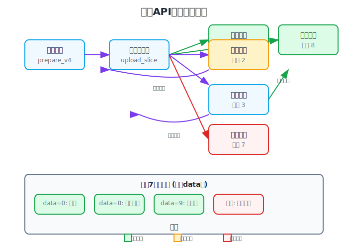

# 钛盘 API 集成规范

本文档描述了钛盘上传 API 的集成规范和状态码定义。

## API 端点

### 基础信息
- **API服务器**: `https://tmplink-sec.vxtrans.com/api_v2` (固定地址)
- **上传服务器**: 动态分配，通过API获取可用服务器列表
- **请求格式**: `application/x-www-form-urlencoded`
- **认证方式**: Token 认证

**注意**: API服务器地址是固定的，程序中硬编码，不可通过参数修改。只有上传服务器可以手动选择或自动分配。

### 主要端点

#### 1. 用户信息获取
```
POST /api_v2/user
```
**参数**:
- `action`: `get_detail`
- `token`: 用户API令牌

**响应**:
```json
{
  "status": 1,
  "data": {
    "uid": "用户ID",
    "email": "用户邮箱",
    "sponsor": 0
  }
}
```

#### 2. 上传令牌请求
```
POST /api_v2/file
```
**参数**:
- `action`: `upload_request_select2`
- `token`: 用户API令牌
- `filesize`: 文件大小(字节)

**响应**:
```json
{
  "status": 1,
  "data": {
    "utoken": "上传令牌",
    "servers": ["服务器URL列表"]
  }
}
```

#### 3. 分片上传
```
POST {server_url}/app/upload_slice
```
**参数**:
- `token`: 用户API令牌
- `uptoken`: 客户端生成的上传令牌
- `action`: 操作类型 (`prepare` 或 `upload_slice`)
- `sha1`: 文件SHA1哈希
- `filename`: 文件名
- `filesize`: 文件大小
- `slice_size`: 分片大小
- `utoken`: 服务器提供的上传令牌
- `mr_id`: 目录ID (默认"0")
- `model`: 文件有效期

## 状态码定义

### 上传状态码

| 状态码 | 含义 | 客户端操作 |
|--------|------|-----------|
| **1** | 上传完成 | 获取下载链接 |
| **2** | 等待其他分片 | 轮询查询状态 |
| **3** | 进入上传流程 | 获取分片编号并上传 |
| **4** | 分片任务不存在 | 重新初始化任务 |
| **5** | 分片上传完成 | 继续下一分片 |
| **6** | 文件已存在(秒传) | 清理本地文件 |
| **7** | 上传失败 | 检查data字段错误信息 |
| **8** | 分片合并完成 | 上传成功完成 |
| **9** | 合并进行中 | 等待合并完成 |

### 错误状态码(状态7的data值)

| data值 | 错误含义 |
|--------|----------|
| **8** | 文件夹未找到 |
| **其他** | 具体错误信息 |

## 客户端实现规范

### 1. uptoken 生成算法
```go
uptoken := sha1.Sum([]byte(sha1Hash + filename + filesize + slice_size))
```

### 2. 上传流程状态机


### 3. 分片上传算法
```go
func uploadSlice(sliceIndex int, data []byte) error {
    params := map[string]string{
        "token":      token,
        "uptoken":    uptoken,
        "action":     "upload_slice",
        "sha1":       fileSHA1,
        "filename":   filename,
        "filesize":   strconv.FormatInt(filesize, 10),
        "slice_size": strconv.FormatInt(sliceSize, 10),
        "utoken":     serverUtoken,
        "mr_id":      mrID,
        "model":      strconv.Itoa(model),
        "index": strconv.Itoa(sliceIndex),
    }
    
    // 添加文件数据
    // 发送POST请求
    // 处理响应状态
}
```

### 4. 错误处理策略

#### 网络错误
- 快速失败策略
- 立即返回错误信息
- 超时时间设置

#### API错误
- 状态7: 根据data值分类处理
- 状态2/9: 实现轮询机制
- 其他错误: 记录详细日志并立即退出

### 5. 参数验证规则

#### 必需参数验证
```go
func validateParams(params map[string]string) error {
    required := []string{"token", "uptoken", "action", "sha1", "filename", "filesize", "slice_size", "utoken", "mr_id", "model"}
    for _, key := range required {
        if params[key] == "" {
            return fmt.Errorf("missing required parameter: %s", key)
        }
    }
    return nil
}
```

#### 文件大小限制
- 最大分片大小: 80MB
- 最小分片大小: 1MB
- 推荐分片大小: 3MB

## 实现注意事项

### 1. mr_id 参数
- **重要**: 默认值必须为字符串 `"0"`，不能为空字符串
- 空字符串会导致状态7(data=8)"文件夹未找到"错误
- 值`"0"`表示根目录

### 2. model 参数
- `0`: 24小时有效期
- `1`: 3天有效期  
- `2`: 7天有效期
- `99`: 无限期有效期

### 3. 并发控制
- 建议最大并发分片数: 5
- 避免过多并发请求导致服务器拒绝

### 4. 状态轮询
- 状态2/9时轮询间隔: 2-5秒
- 最大轮询时间: 300秒
- 轮询超时后标记为失败

## 测试验证

### 单元测试
- uptoken生成算法
- 参数验证逻辑
- 状态码处理

### 集成测试  
- 完整上传流程
- 错误场景模拟
- 大文件分片上传

### 性能测试
- 并发上传压力测试
- 网络异常恢复测试
- 内存使用情况监控