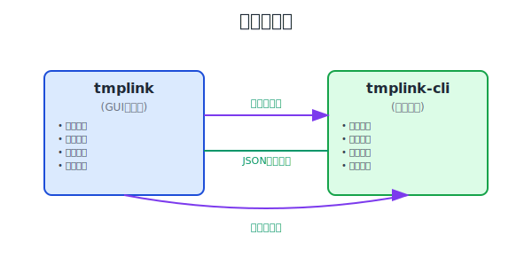
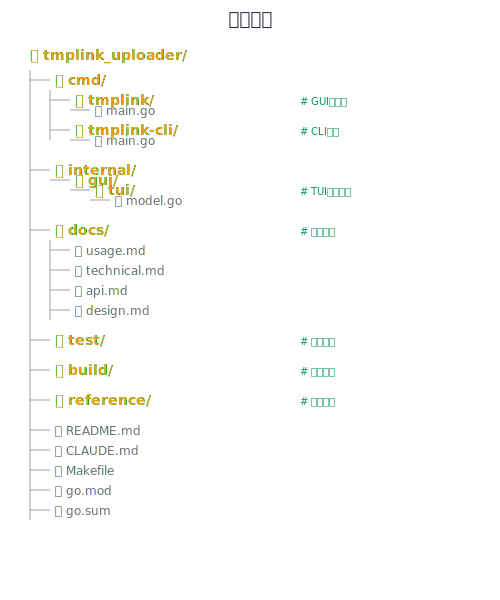

# 技术文档

## 系统架构

### 双进程架构设计



#### 设计优势

- **进程独立**：上传进程崩溃不影响主界面
- **资源隔离**：每个文件独立进程，避免相互影响
- **可扩展性**：支持并发上传多个文件
- **监控能力**：通过状态文件实时监控进度

#### 进程通信

**GUI进程 → CLI进程**：
- 通过命令行参数传递配置
- 传递任务ID和状态文件路径

**CLI进程 → GUI进程**：
- 通过JSON状态文件报告进度
- 实时更新上传状态和速度

### CLI运行模式

CLI程序根据是否提供 `-task-id` 参数自动选择运行模式：

#### CLI模式（交互使用）
- **触发条件**：不提供 `-task-id` 参数
- **适用场景**：个人手动使用
- **特性**：
  - 🎯 实时进度条显示（类似wget/curl）
  - ⚡ 速度监控和ETA计算
  - 🎨 美观的终端输出
  - 📊 上传完成统计信息

#### GUI模式（程序调用）
- **触发条件**：提供 `-task-id` 参数
- **适用场景**：GUI程序调用
- **特性**：
  - 📄 JSON状态文件输出
  - 🔄 后台静默运行
  - 📡 进程间通信支持

### 权限系统

#### 普通用户功能
- ✅ 文件上传下载
- ✅ 基础设置配置
- ✅ 自动服务器选择
- ✅ 标准上传速度监控

#### 赞助用户专享功能
- ⭐ 分块大小自定义（1-99MB）
- ⭐ 并发数控制（1-20）
- ⭐ 手动服务器选择
- ⭐ 快速上传开关控制
- ⭐ 优先服务器访问

### 状态文件格式

CLI通过JSON状态文件与GUI进行进程间通信：

```json
{
  "id": "upload_1640995200",
  "status": "uploading",
  "file_path": "/path/to/file.txt",
  "file_name": "file.txt",
  "file_size": 1048576,
  "progress": 75.5,
  "upload_speed": 2.5,
  "download_url": "",
  "error_msg": "",
  "created_at": "2023-12-31T12:00:00Z",
  "updated_at": "2023-12-31T12:01:00Z",
  "process_id": 12345
}
```

#### 状态值说明
- `pending`: 任务创建，准备开始
- `uploading`: 正在上传
- `completed`: 上传完成
- `failed`: 上传失败

#### 字段说明
- `upload_speed`: 实时上传速度（MB/s），使用加权平均算法
- `process_id`: CLI进程ID，用于进程管理
- `progress`: 上传进度百分比（0-100）

## 开发指南

### 技术栈

- **编程语言**: Go 1.23+
- **GUI框架**: [Bubble Tea](https://github.com/charmbracelet/bubbletea) - 现代TUI框架
- **CLI框架**: Go标准库flag包
- **HTTP客户端**: Go标准库net/http
- **进度条**: [progressbar/v3](https://github.com/schollz/progressbar)
- **构建工具**: GNU Make

### 核心依赖

```go
// GUI相关
github.com/charmbracelet/bubbletea        // TUI框架
github.com/charmbracelet/bubbles          // TUI组件
github.com/charmbracelet/lipgloss         // TUI样式

// CLI相关  
github.com/schollz/progressbar/v3         // 进度条显示

// 工具库
github.com/mattn/go-runewidth            // Unicode宽度计算
github.com/google/uuid                   // UUID生成
```

### 项目结构



### 构建系统

#### Make命令

```bash
# 开发相关
make deps         # 安装依赖
make fmt          # 代码格式化
make vet          # 代码静态检查
make test         # 运行测试

# 构建相关
make build        # 构建当前平台
make release      # 构建所有平台
make dist         # 创建发布包
make clean        # 清理构建产物

# 运行
make run          # 直接运行GUI
```

#### 跨平台构建

支持的目标平台：

| 平台 | 架构 | GOOS | GOARCH |
|------|------|------|--------|
| macOS Intel | x86_64 | darwin | amd64 |
| macOS Apple Silicon | ARM64 | darwin | arm64 |
| Windows | x86_64 | windows | amd64 |
| Windows | i386 | windows | 386 |
| Linux | x86_64 | linux | amd64 |
| Linux | i386 | linux | 386 |
| Linux | ARM64 | linux | arm64 |

### 测试框架

#### 测试组织

- **单元测试**: 测试单个函数和组件
- **集成测试**: 测试组件间交互
- **架构测试**: 验证双进程架构合规性

#### 测试规则

1. **文件组织**: 所有测试文件和临时文件必须放在 `test/` 目录
2. **命名规范**: 
   - 测试输入文件: `test/<size>_test.<ext>`
   - 状态文件: `test/status_<test-id>.json`
   - 日志文件: `test/test_<feature>_<date>.log`
3. **清理**: 测试完成后清理临时文件

### API集成

#### 服务器架构

- **API服务器**: `https://tmplink-sec.vxtrans.com/api_v2` (固定)
- **上传服务器**: 动态分配，支持手动选择

#### 请求格式

所有API请求使用 `application/x-www-form-urlencoded` 格式，与Web界面保持一致。

#### 认证方式

使用Token认证，Token从浏览器localStorage获取：
1. 用户登录钛盘网站
2. 从浏览器开发者工具获取Token
3. 通过 `-set-token` 保存到配置文件

### 错误处理策略

#### 快速失败原则

- 遇到错误立即退出，不进行重试
- 提供详细的错误信息和调试信息
- 错误信息本地化（中文）

#### 错误分类

1. **配置错误**: 参数不正确、文件不存在等
2. **网络错误**: 连接失败、超时等
3. **API错误**: Token无效、服务器错误等
4. **文件错误**: 权限问题、磁盘空间不足等

### 性能优化

#### 上传优化

- **分块上传**: 大文件自动分块，支持1-99MB分块大小
- **并发上传**: 多个分块并发上传，提高效率
- **SHA1缓存**: 避免重复计算文件哈希
- **秒传检查**: 基于SHA1的文件去重

#### 内存管理

- **流式处理**: 大文件分块读取，避免一次性加载到内存
- **资源释放**: 及时关闭文件句柄和网络连接
- **垃圾回收**: 合理使用Go的垃圾回收机制

### 安全考虑

#### 数据安全

- **HTTPS传输**: 所有API调用使用HTTPS
- **Token加密**: 配置文件中的敏感信息加密存储
- **临时文件**: 使用安全的临时文件创建

#### 输入验证

- **文件路径**: 验证文件路径合法性
- **参数校验**: 严格校验所有输入参数
- **大小限制**: 强制执行文件大小限制（50GB）

## 调试指南

### 调试模式

```bash
# 启用详细日志
./tmplink-cli -debug -file test.txt

# 查看API请求详情
./tmplink-cli -debug -file test.txt 2>&1 | grep "API"

# 监控状态文件
watch -n 1 'cat upload_*_status.json | jq .'
```

### 常见问题排查

#### Token问题
```bash
# 验证Token有效性
./tmplink-cli -debug -token YOUR_TOKEN -file small_test.txt
```

#### 网络问题
```bash
# 测试网络连接
curl -X POST https://tmplink-sec.vxtrans.com/api_v2/user \
  -d "action=get_detail&token=YOUR_TOKEN"
```

#### 文件权限问题
```bash
# 检查文件权限
ls -la /path/to/file
stat /path/to/file
```

### 日志分析

#### GUI日志
GUI程序的日志输出到标准输出，包含：
- 用户操作事件
- 文件选择和上传启动
- CLI进程启动和监控
- 错误和警告信息

#### CLI日志
CLI程序使用 `-debug` 参数启用详细日志：
- API请求和响应详情
- 文件处理进度
- 分片上传状态
- 错误堆栈信息

## 贡献指南

### 代码规范

1. **Go格式化**: 使用 `gofmt` 和 `goimports`
2. **命名规范**: 遵循Go语言命名约定
3. **注释要求**: 公开函数必须有注释
4. **错误处理**: 所有错误必须正确处理

### 提交规范

```bash
# 格式化代码
make fmt

# 运行测试
make test

# 静态检查
make vet

# 构建验证
make build
```

### 分支策略

- `main`: 主分支，稳定版本
- `develop`: 开发分支，新功能开发
- `feature/*`: 功能分支
- `bugfix/*`: 修复分支

### 版本发布

1. 更新版本号和更新日志
2. 运行完整测试套件
3. 构建所有平台版本
4. 创建Git标签
5. 发布到GitHub Releases